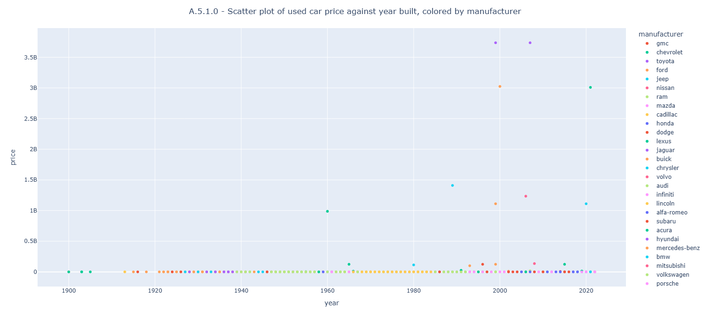
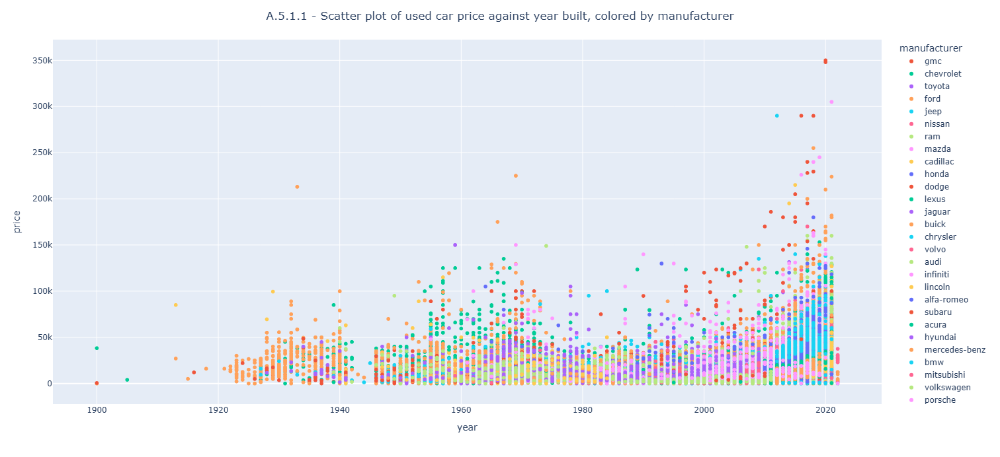
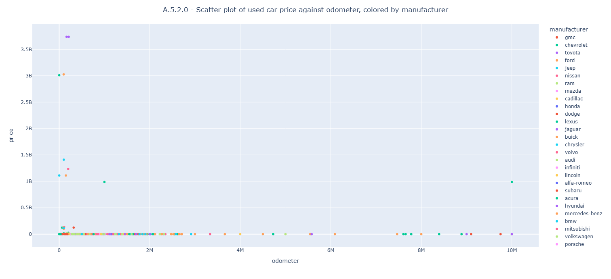
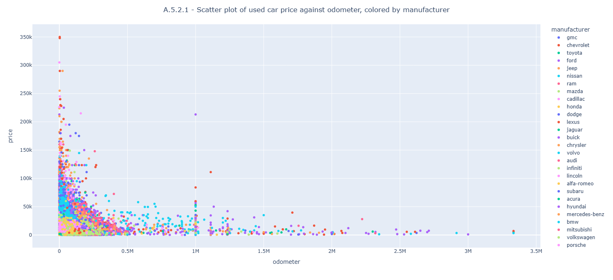
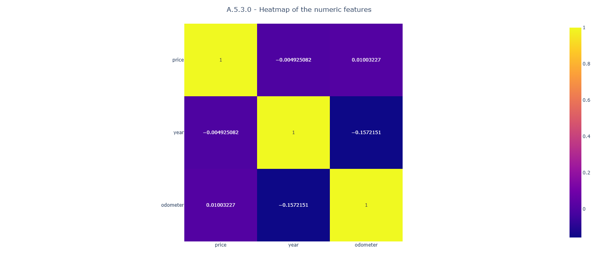
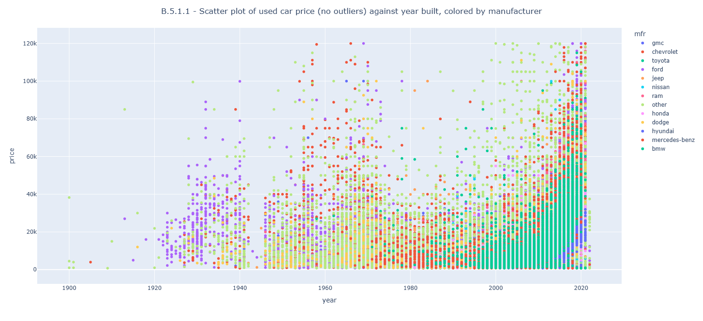
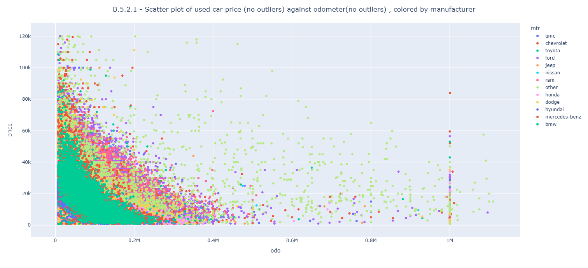
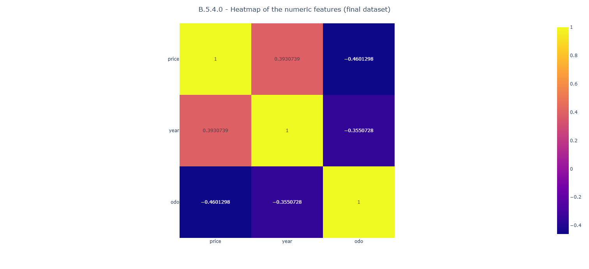
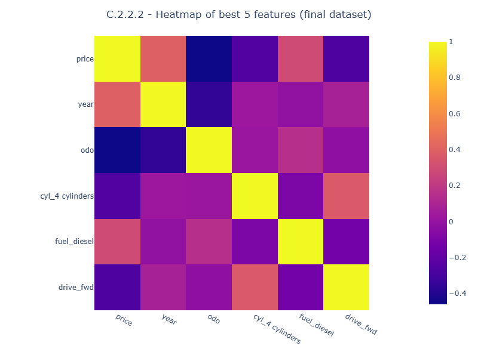
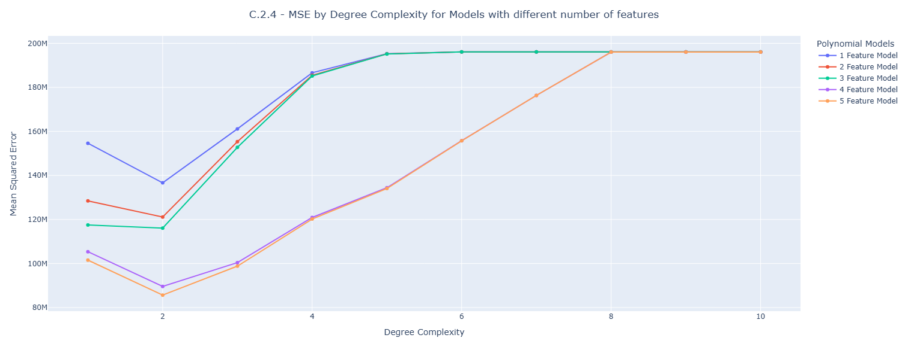

# used-car-price-predictors
**What features drive the price of a used car?**

**My Role:** I'm a consultant to a used car dealership.

**Business Problem:** A used car dealership wants to fine-tune their inventory to maximize sales. I have been tasked to identify factors that drive prices of used cars and recommend what customers value in used cars. Based on my recommendations the dealership will adjust their inventory.

**Data Problem:** I need to understand, prepare, and model the available historical data with the objective to find car features that are highly correlated to price and can be used to predict the price of a used car successfully. This involves using exploratory data analysis to identify important features, cleaning and transforming the data, and then training a suitable machine learning model to make predictions. In data science, this is a regression problem to predict price of a used car (a continuous value).

<b>A. Steps I tool to understand the data:</b>
1. Explored the data using Pandas Dataframe and its supported functions like info() for schema and datatype info and describe() for basic statistical information.
2. Found features with missing values and undersatnd amount of data with missing values per feature.
3. Found unique values of each feature.
4. Investigated duplicate records.
5. Performed Exploratory Data Analysis (EDA) on the dataset by generating appropriate plots.
   
   
   
   
   
6. Observed numerical vs categorical features of the data.
7. Observed features that are not correlated to price of used cars.

**My Observations:**
* Total of **426880** records
* Numerical features: **id**, **price**, **year**, and **odometer**
    * **price** ranges from <b>0 to 3,736,928,711 (presence of outliers on both ends of the range)</b>
    * **year** ranges from 1900 to 2022
    * **odometer** ranges from <b>0 to 10,000,000 (presence of outliers on both ends of the range)</b>
* Categorical features with contained values (candidates for one-hot encoding): **condition**, **cylinders**, **fuel**, **title_status**, **transmission**, **drive**, **size**, **type**, and **paint_color**
* Features with extensive <b>missing values</b> are:
    * **condition** with 40.79% missing values
    * **cylinders** with 41.62% missing values
    * **VIN** with 37.73% missing values
    * **drive** with 30.59% missing values
    * **size** with 71.77% missing values
    * **type** with 21.75% missing values
    * **paint_color** with 30.5% missing values
* Features that are most likely to be correlated to price of used cars are **year** and **odometer**
* Features that are not correlated to price to price of used cars are **id** and **VIN**

<b>B. Steps I took to prepare the data:</b>
1. Dropped <b>68 records with all the feature values missing</b>.
2. Dropped <b>features id and VIN</b> that are <b>not related to the price of used cars</b>.
3. Dropped <b>5,468 records with missing values of the numerical features</b>.
4. Handled all categorical features to <b>enable one-hot encoding</b>.
5. Handled <b>outliers in Price and Odometer data</b> values.
   
   
   
6. Created modeling data with <b>all numerical features using one-hot encoding</b>.

<b>C. Steps I took to model the data using Polynomial Regression:</b>
1. With 243 features in the modeling dataset (after one-hot encoding), <b>I used Sequential Feature Selection to select optimum number of features</b> for Linear regression based on average coss-validation score as negative MSE. The optimum number of features was five.
   
3. Compared different <b>Polynomial regression models with 1 to 5 Sequential Feature Selection and Polynomial feature (degree complexity) from 1 to 10</b> using MSE.
   
5. Using training data the <b>best Polynomial regression model based on minimum MSE had 5 features (Year, Odometer, 4 cylinders, Diesel Fuel, and Forward Drive) and degree of 2</b>.
6. Validated the identified best Polynomial regression model using the testing dataset. The <b>best Polynomial regression model based on training data minimum MSE was still the same (5 features and degree of 2)</b>.
7. The minimum MSE using the testing data was 86.00627 Million - that means <b>an average error of of about $9,274 to predict the price of a used car</b>.

<b>D. Conclusion:</b> 
An <b>average error of about $9,274</b> may be useful to predict the price of a used car but it seems like <b><mark>this may NOT be the best model possible</mark></b>. I would explore other regression models like Random Forest or XGBoost (Gradient Boosting) that might result in lower average error.
